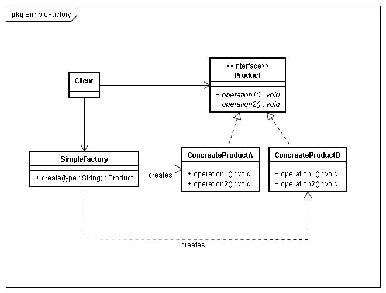
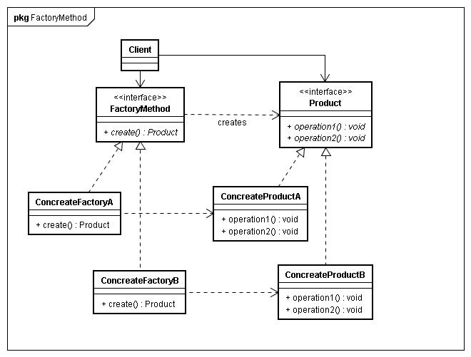

##1.简单工厂，客户端通过Factory 参数拿到id<protocol> 对象，调用方法。注意：使用者知道Factory，和protocol 协议
##2.工厂方法 只有一个产品接口，可以有N种产品，对应就有N中工厂类。缺点：客户端需要做逻辑判断
##3.抽象工厂 有 X种接口，每种有N种实现。对应有N种工厂。缺点：客户端需要做逻辑判断。
##区别
简单工厂 ： 无用多说
工厂方法 ：一种工厂对应 一种实例    
抽象工厂 ：用来生产不同产品族的全部产品。一种工厂 对应N中实例。比如 factory 生成 IUser IDepartment.
##看度

